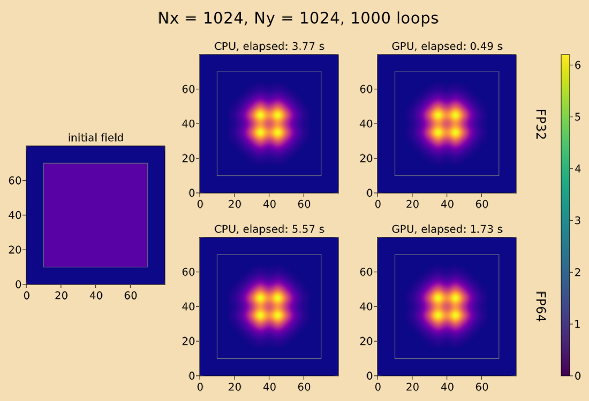

# AngularSpectrum.jl

AngularSpectrum.jl is a Julia package for simulation of 2D wave propagation in free space based on angular spectrum theory.

## Installation
Currently not registered and under development. But the main branch can be installed with:
```julia
julia> ] add https://github.com/lihua-cat/AngularSpectrum.jl
```

## Features
* wave propagation between 2 planes
* wave propagation between 1 plane and 1 curved surface.
* wave propagation between 2 curved surfaces.

## Usage
1. given a initial uniform 2D optical field distribution
```julia
X, Y = 8.0u"cm", 8.0u"cm"
Nx, Ny = 1024, 1024
x = collect(0:Nx-1) * X / Nx
y = collect(0:Ny-1) * Y / Ny
ap = (x = 6.0u"cm", y = 6.0u"cm")
ap_mask = (abs.(x .- X/2) .< ap.x/2) .* transpose(abs.(y .- Y/2) .< ap.y/2) 
u = ones(ComplexF64, Nx, Ny) .* ap_mask
```
2. compute propagation function of angular spectrum
```julia
λ = 10.6u"μm"
d = 1.5u"m"
trans = propagation_func(X, Y, Nx, Ny, λ, d)
```
3. angular spectrum approach
```julia
# cpu
PRECISION = Float32
N = 1000
u_h = convert.(Complex{PRECISION}, u)
trans_h = convert.(Complex{PRECISION}, trans)
plan_h, iplan_h = plan_fft!(u_h, flags=FFTW.MEASURE), plan_ifft!(u_h, flags=FFTW.MEASURE)
# warm-up
free_propagate!(u_h, trans_h, plan_h, iplan_h)
u_h .*= ap_mask
t1 = @elapsed for _ in 2:N
    free_propagate!(u_h, trans_h, plan_h, iplan_h)
    u_h .*= ap_mask
end
t1 = round(t1, digits = 2)
# gpu
u_d = CuArray{Complex{PRECISION}}(u)
trans_d = CuArray{Complex{PRECISION}}(trans)
plan_d, iplan_d = plan_fft!(u_d), plan_ifft!(u_d)
ap_mask_d = CuArray(ap_mask)
# warm-up
free_propagate!(u_d, trans_d, plan_d, iplan_d)
u_d .*= ap_mask_d
t2 = @elapsed for _ in 2:N
    free_propagate!(u_d, trans_d, plan_d, iplan_d)
    u_d .*= ap_mask_d
end
t2 = round(t2, digits = 2)
```
4. visualization
```julia
let
    uu = u"mm"
    Xv, Yv = ustrip(uu, X), ustrip(uu, Y)
    ap_v = (; x = ustrip(uu, ap.x), y = ustrip(uu, ap.y))
    apx1, apy1 = @. ((Xv, Yv) - (ap_v.x, ap_v.y)) / 2
    apx2, apy2 = @. (Xv, Yv) - (apx1, apy1)
    ap_poly = Point2f0[(apx1, apy1), (apx1, apy2), (apx2, apy2), (apx2, apy1)]
    x = collect(0:Nx-1) * Xv / Nx
    y = collect(0:Ny-1) * Yv / Ny
    intensity = Array{Complex{PRECISION}, 3}(undef, Nx, Ny, 3)
    intensity[:, :, 1] = abs2.(u)
    intensity[:, :, 2] = abs2.(u_h)
    intensity[:, :, 3] = Array(abs2.(u_d))

    fig = Figure(resolution = (1400, 600))
    title = ["initial field (Nx = $Nx, Ny = $Ny)", "cpu(i9-11900KB) $N loops, elapsed: $t1 s", "gpu(RTX3060Ti) $N loops, elapsed: $t2 s"]
    ax = [Axis(fig[1, i], aspect = AxisAspect(Xv/Yv), title = title[i]) for i in 1:3]

    for i in 1:3
        poly!(ax[i], ap_poly, color = :transparent, strokecolor = :cyan, strokewidth = 1)
        h = heatmap!(ax[i], x, y, intensity[:, :, i], colormap = :plasma)
        Colorbar(fig[2, i], h, width = Relative(1), vertical = false)
    end
    fig
end
```


## Reference
* Goodman, Joseph W. *Introduction to Fourier optics*